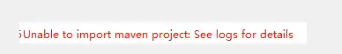

# JavaWeb

## 1、基本概念

### 1.1 前言

web开发：

- web，网页的意思，www.baidu.com

- 静态web

  - html，css
  - 提供给所有人看的数据始终不会发生变化

- 动态web

  - 淘宝，几乎是所有网站；
  - 提供给所有人的数据始终会发生变化，每个人在不同的时间，不同的地点看到的信息各不相同。
  - 技术栈：Servlet/JSP，ASP，PHP。

  在java中，动态web资源开发的技术统称为javaweb

### 1.2 web应用程序

web应用程序：可以提供浏览器访问的程序；

- a.html，b.html....多个web资源，这些web资源可以被外界访问，对外界提供服务。
- 你们能访问到的任何一个页面或者资源，都存在于世界的某个角落的计算机上。
- URL（统一资源定位符）
- 这个统一的web资源会被放在同一个文件夹下，web应用程序-->Tomcat:服务器
- 一个web应用由多部分组成（静态web，动态web）
  - html，css，js
  - jsp，servlet
  - java程序
  - jar包
  - 配置文件（Properties）

**web应用程序编写完毕后，若想提供给外界访问：需要一个服务器统一管理。**

### 1.3 静态web

- *.html，*.html,这些都是网页的后缀，如果服务器上一直存在这些东西，我们就可以直接进行读取。同络


- 静态web存在的缺点

  - web页面无法动态更新，所有用户看到都是同一个页面
    - 轮播图，点击特效：伪动态
    - JavaScript[实际开发中，它用的最多]
    - VBScript
  - 它无法和数据库交互（数据无法持久化，用户无法交互）
  
  ### 1.4 动态web
  

页面会动态展示：”Web的页面展示效果因人而异“


缺点

- 加入服务器的动态web资源出现了错误，我们需要重新编写我们的**后台程序**，重新发布；
  - 停机维护

优点

- web页面可以动态更新，所有用户看到都不是同一个页面
- 它可以和数据库交互（数据无法持久化：注册，商品信息，用户信息）


## 2、web服务器

### 2.1 技术讲解

**ASP:**

- 微软：国内最早流行的就是ASP；

- 在html中嵌入了VB的脚本，ASP + COM；

- 在ASP开发中，基本一个页面都有几千行的业务代码，页面及其混乱。

- 维护成本高

  ```html
  <h1>
      <h1><h1>
          <h1>
              <% System.out.println();
          </h1>
          </h1>
  	<h1><h1>  
  <h1>    
  ```

**php:**

- PHP开发速度很快，功能很强大，跨平台，代码简单（70%，WP）
- 无法承载大访问量的情况（局限性）；

**Jsp/Servlet:**

B/S：浏览器和服务器

C/S：客户端和服务器

- sun公司主推的B/S架构

- 基于java语言的（所有的大公司，或者一些开源的组件，都是用java写的）

- 可以承载三高问题带来的影响。高并发，高可用，高性能。

- 语法像ASP，ASP-->JSP,加强市场强度。

  ### 2.2 web服务器

  服务器是一种被动的操作，用来处理用户的一些请求和给用户一些响应信息；

  

  **lls**

  微软的；ASP本土的东西，Windows中自带的

  **tomcat**

  

  Tomcat是Apache软件基金会(Apache Software Foundation)的Jakarta项目中的一个核心项目，最新的Servlet和SP规范总是能在Tomcat中得到体现，因为Tomcat 技术先进、性能稳定，而且免费，因而深受Java爱好者的喜爱并得到了部分软件开发商的认可，成为目前比较流行的Web应用服务器。

  Tomcat服务器是一个免费的开放源代码的Web应用服务器，属于轻量级应用服务器，在中小型系统和并发访问用户不是很多的场合下被普遍使用，是开发和调试SP程序的首选。对于一个Java初学web的人来说，它是最佳的选择。

  Tomcat 实际上运行SP页面和Servlet。Tomcat最新版本为9.0。

  **工作3-5年，可以尝试手写Tomcat服务器；**
  
  

## 3. Tomcat

### 3.1 安装tomcat

官网https://tomcat.apache.org/


解压


### 3.2 Tomcat启动和配置

文件夹作用：


启动，关闭tomcat


访问测试：http://local host:8080/

可能遇到的问题：

1、java环境变量没有配置

2、闪退问题：需要配置兼容性。

3、乱码问题：配置文件中的设置。startup.bat

### 3.3 配置


可以配置启动端口号

```xml
<Connector port="8080" protocol="HTTP/1.1"
               connectionTimeout="20000"
               redirectPort="8443" />
```

- tomcat的默认端口号：8080
- mysql:3306
- https:443
- http:80

可以配置主机的名字

- 默认的主机名为：localhost ->127.0.0.1
- 默认网站应用存放的位置为：webapps

```xml
<Host name="localhost"  appBase="webapps"
            unpackWARs="true" autoDeploy="true">
```


### 高难度面试题

请你谈谈网站是如何进行访问的！

1、输入你个域名；回车

2、检查本机的C:\Windows\System32\drivers\etc\hosts配置文件下有没有这个域名映射；

- 有：直接返回对应的ip地址，这个地址中，有我们需要访问的web程序，可以直接访问。

  ```java
  	127.0.0.1       localhost
  ```

- 没有：去DNS服务器找，找到的话就返回，找不到就返回找不到；

  


4.可以配置一下环境变量（可选项）

### 3.4 发布一个web网站

- 将自己写的网站，放到服务器（Tomcat）中指定的web应用的文件夹（webapps）下，就可以访问了。

网站应有的结构

```java
--webapps : tomcat 服务器的web目录
	-ROOT
	-TEST ：网站的目录名
	 	- WEB-INF
	 		-class:java程序
	 		-lib：web应用所依赖的jar包
	 		-web.xml：网站配置文件
	 	- index.html：默认首页
	 	- static
	 		-css
	 			-style.css
	 		-js
	 		-img
	 	-.....
```


## 4、HTTP

### 4.1 什么是HTTP

HTTP（超文本传输协议）是一个简单的请求-响应协议，它通常运行再TCP(传输控制协议)

​					UDP（协议报文传输）

- 文本：html，字符串，~....
- 超文本：图片，音乐，视频，地位，地图......
- 80

Https:安全的

- 443

### 4.2 两个时代

- http1.0
  - HTTP/1.0：客户端可以和web服务器连接后，只能获得一个web资源，断开连接。
- http2.0
  - HTTP/1.1：客户端可以和web服务器连接后，可以获得多个web资源。

### 4.3 Http请求

- 客户端---发请求---服务器

百度：

```java
Request URL:https://www.baidu.com/Request
Method :GET
status code : 200 oK
Remote Address : 14.215.177.39:443
```

```java
Accept:text/html
Accept-Encoding:gzip，deflate，br
Accept-Language :zh-cN , zh; q=0.9 语言
cache-contro1 :max-age=O
connection : keep-alive
```


#### 1、 请求行

- 请求行中的请求方式：GET
- 请求方式：**Get/Post**，HEAD，DELETE，PUT，TRACT...
  - get：请求能够携带的参数比较少，大小由限制，会在浏览器的URL地址栏显示数据内容，不安全，但高效。
  - post：请求能够携带的参数没有限制，大小没有限制，不会在浏览器的URL地址栏显示数据内容，安全，但不q高效。

#### 2、消息头

```java
Accept:text/html  告诉浏览器，它所支持的数据类型
Accept-Encoding:gzip，deflate，br  支持哪种编码格式 GBK UTF-8 GB2312 ISO8859-1
Accept-Language :zh-cN , zh; q=0.9 告诉浏览器语言环境
cache-contro1 :max-age=O 缓存控制
connection : keep-alive 告诉浏览器，请求完成是断开还是保持连接
```


### 4.4 Http响应

- 服务端---响应----客户端

百度：

```java

Cache-Control private //缓存控制
Connection	keep-alive //连接
Content-Encoding:gzip // 编码
Content-Type text/html;// 类型
```

#### 1、响应体

```java
Accept:text/html  告诉浏览器，它所支持的数据类型
Accept-Encoding:gzip，deflate，br  支持哪种编码格式 GBK UTF-8 GB2312 ISO8859-1
Accept-Language :zh-cN , zh; q=0.9 告诉浏览器语言环境
cache-contro1 :max-age=O 缓存控制
connection : keep-alive 告诉浏览器，请求完成是断开还是保持连接
refrush:告诉客户端，多久刷新一次
location：让网页重新定位；
```

#### 2、响应状态码

200：请求响应成功

3**：请求重定向

- 重定向：你重新到我给你的新位置

4**：找不到资源

- 资源部存在；

5**：服务器代码错误  500  502网关错误


常见面试题：

当你的浏览器中地址栏输入地址并回车的一瞬间到页面能够展示回来，经历了什么？

## 5、Maven

**我们为什么要学习这个技术**

1、在javaweb开发中，需要使用大量的jar包，我们手动去导入；

2、如何能够让一个东西自动帮我导入和配置这个jar包

由此，Maven诞生了。

### 5.1 Maven项目架构管理工具

我们目前用来就是方便导入jar包的！

Maven的核心思想：**约定大于配置**

- 有约束，不要去违反

Maven会规定号你该如何去编写我们的java代码，必须按照这个约定来。


### 5.2 下载安装Maven

官网：https://maven.apache.org/


下载完成后，解压即可；

建议：电脑上的所有的环境都放在一个文件夹下；


### 5.3 环境配置

在我们的系统环境变量中

配置如下配置：

- M2_HOME  maven目录下的bin目录
- MAVEN_HOME maven的目录
- 在系统的path中配置 %MAVEN_HOME%\bin

### 5.4 阿里云镜像

- 镜像：mirrors
  - 作用：加速我们的下载
- 国内建议使用阿里云的镜像

```xml
<mirror>
     <id>alimaven</id>
     <name>aliyun maven</name>
     <url>http://maven.aliyun.com/nexus/content/groups/public/</url>
     <mirrorOf>central</mirrorOf>
</mirror>
```

### 5.5 本地仓库

在本地的仓库，远程仓库： 

**建立一个本地仓库：**

```xml
<localRepository>D:\apache-maven-3.8.2_repository</localRepository>
```

### 5.6 在IDEA中使用Maven

​	1. 启动idea

​	2. 创建一个Maven项目

​	


3.等待项目初始化完毕


4. 观察Maven仓库多了什么东西？

5. idea中的Maven的设置

idea项目创建成功后，看一眼Maven的配置


6. 到这里，Maven在idea中的配置和使用就完成了。

### 5.7 创建一个普通的Maven项目


这个只有在web应用下才有。

### 5.8 标记文件夹功能

​	1 .  


2. 


### 5.9 在idea中配置Tomcat


解决警告问题：

**为什么会有这个问题：我们访问一个网站，需要指定一个文件夹名字**


### 5.10 pom文件

pom.xml 是Maven的核心配置文件


maven由于它的约定大于配置，我们之后可能遇到我们写的配置文件，无法被导出或者生效的问题。

解决方案：

```xml
<! --build中配置resources，来防止我们资源导出失败的问题-->
<build>
	<resources>
        <resource>
            <directory>src/main/ resources</directory><excludes>
            <excludes>
                <exclude>**/*.properties</exclude>
                <exclude>**/*.xml</exclude>
            </excludes>
            <filtering>false</filtering> 
        </resource>
        <resource>
            <directory>src/main/java</directory>
            <includes>
                <include>**/*.properties</include>
                <include>**/*.xml</include>
            </includes>
            <filtering>false</filtering></ resource>
         </resource>
	</resources>
</build>
```


### 5.11 idea操作


### 5.13 解决遇到的问题

1. Maven 3.6.2

   解决方法：降级为3.6.1

   

2. Tomcat闪退

   ​	

3. Idea中每次都要重复配置Maven

   在idea中的全局默认配置中去配置

   

   

4. Maven项目中Tomcat无法配置

5. maven默认web项目中的web.xml版本问题

   

6. 提花你为webapps4.0版本和tomat一致

7. Maven仓库的使用

   地址：https://mvnrepository.com/

   


## 6、Servlet

### 6.1 Servlet简介

- Servlet就是sun公司开发动态web的一门技术
- Sun在这些API中提供一个接口叫做：Servlet，如果你想开发一个Sevlet程序，只需要完成两个小步骤
  - 编写一个类，实现Servlet接口
  - 把开发好的java类部署到web服务器中

**把实现了Servlet接口的java程序叫做，Servlet**

### 6.2 HelloServlet

Servlet接口在Sun公司有两个默认的实现类：HttpServlet，


1. 构建一个普通的Maven项目，删掉里面的src目录，以后我们的学习就在这个项目里建立model；这个空的工程就是Maven主工程；

2. 关于Maven父子工程的理解：

   1. 父项目于中有：

      ```xml
          <modules>
              <module>subservlet-01</module>
          </modules>
      ```

      

    2. 子项目中有：

       ```xml
          <parent>
               <artifactId>javaweb-servlet-01</artifactId>
               <groupId>com.lbgao</groupId>
               <version>1.0-SNAPSHOT</version>
           </parent>
       ```

   父项目中的java子项目可以直接使用

3. Maven环境优化

   - 修改web.xml
   - 将maven的结构搭建完整

4. 编写一个Servlet程序

   1. 编写一个普通类
   2. 实现Servlet接口，这里直接继承HttpServlet
   3. 

5. 编写Servlet的映射

   - 为什么需要映射？

     **我们写的是java程序，但是要通过浏览器访问，而浏览器需要连接web服务器，所以我们需要在web服务器中注册我们写的Servlet，还需要给它一个浏览器能够访问的路径；**

     ```xml
     <!--    注册Servlet-->
         <servlet>
             <servlet-name>hello</servlet-name>
             <servlet-class>com.lbgao.servlet.HelloServlet</servlet-class>
         </servlet>
     <!--    Servlet的请求路径-->
         <servlet-mapping>
             <servlet-name>hello</servlet-name>
             <url-pattern>/hello</url-pattern>
         </servlet-mapping>
     ```

     

6. 配置Tomcat

7. 启动测试

### 6.3 Servlet原理

Servlet是由Web服务器调用，web服务器在收到浏览器请求后，会：


### 6.4 Mapping问题

1. 一个Servlet可以指定一个映射路径

   ```xml
   <servlet-mapping>
           <servlet-name>hello</servlet-name>
           <url-pattern>/hello</url-pattern>
       </servlet-mapping>
   ```

2. 一个Servlet可以指定多个映射路径

   ```xml
   <servlet-mapping>
           <servlet-name>hello</servlet-name>
           <url-pattern>/hello1</url-pattern>
   </servlet-mapping>
   <servlet-mapping>
           <servlet-name>hello</servlet-name>
           <url-pattern>/hello2</url-pattern>
       </servlet-mapping>
   <servlet-mapping>
           <servlet-name>hello</servlet-name>
           <url-pattern>/hello3</url-pattern>
   </servlet-mapping>
   ```

3. 一个Servlet可以指定通用映射路径

   ```xml
   <servlet-mapping>
           <servlet-name>hello</servlet-name>
           <url-pattern>/hello/*</url-pattern>
   </servlet-mapping>
   ```

4. 指定一些后缀或者前缀等等...

   ```xml
   <!-- 可以自定义后缀实现请求路径
    注意点： *前面不能加项目映射的路径 /hello/*.do
   		-->
   <servlet-mapping>
           <servlet-name>hello</servlet-name>
           <url-pattern>*.do</url-pattern> <!-- hello/dasdasd/djkasdjka.do -->
   </servlet-mapping>
   ```

5. 默认请求路径

   ```xml
   <servlet-mapping>
           <servlet-name>hello</servlet-name>
           <url-pattern>/*</url-pattern>
       </servlet-mapping> 
   ```

6. 优先级问题

   **指定了固有的映射路径优先级最高，找不到就会走默认的处理。**

### 6.5 ServletContext

web容器在启动的时候，它会为每个web程序都创建一个对应的ServletContext对象，代表了当前的web应用；

1. **共享数据**

我在这个Servlet中保存的数据，可以在另外一个servlet中拿到；

	


```java
public class HelloServlet extends HttpServlet {
    @Override
    protected void doGet(HttpServletRequest req, HttpServletResponse resp) throws ServletException, IOException {
        PrintWriter writer = resp.getWriter();

        writer.print("hello");

        ServletContext cont = this.getServletContext();

        String username = "lbgao";
        cont.setAttribute("username",username);
    }

}


public class GetServlet extends HttpServlet {
    @Override
    protected void doGet(HttpServletRequest req, HttpServletResponse resp) throws ServletException, IOException {
        ServletContext context = this.getServletContext();
        String username = (String) context.getAttribute("username");
        System.out.println(username);
        resp.getWriter().print(username);
    }
}
```

2. **获取初始化参数**

```xml
<!--    配置一些web应用初始化参数-->
    <context-param>
        <param-name>url</param-name>
        <param-value>jdbc:mysql://localhost:3306/mybatis</param-value>
    </context-param>
```

```java
public class ServletDemo03 extends HttpServlet {
    @Override
    protected void doGet(HttpServletRequest req, HttpServletResponse resp) throws ServletException, IOException {
        ServletContext context = this.getServletContext();

        String url = context.getInitParameter("url");

        resp.getWriter().print(url);
        resp.getWriter().print(context.getContextPath());

    }
}
```

3. **请求转发**

```java
public class ServletDemo04 extends HttpServlet {
    @Override
    protected void doGet(HttpServletRequest req, HttpServletResponse resp) throws ServletException, IOException {
        ServletContext context = this.getServletContext();

        RequestDispatcher dispatcher = context.getRequestDispatcher("/gp");//转发的请求路径
        dispatcher.forward(req,resp);//调用forward实现转发请求

    }
}
```


4. **读取资源文件**

   Properties

   - 在java目录下新建properties
   - 在resources目录下新建properties

   发现：都被打包到了同一个路劲下：classes，我们俗称这个路径为classpath

   思路：需要一个文件流；

   ```java
   public class ServletDemo05 extends HttpServlet {
       @Override
       protected void doGet(HttpServletRequest req, HttpServletResponse resp) throws ServletException, IOException {
           ServletContext context = this.getServletContext();
   
           InputStream stream = context.getResourceAsStream("/WEB-INF/classes/db.properties");
   
           Properties prop = new Properties();
           prop.load(stream);
           String username = prop.getProperty("username");
           String pwd = prop.getProperty("password");
   
           resp.getWriter().print(username + pwd);
   
       }
   }
   ```

   ```properties
   username=root
   password=12345
   ```


### 6.6 HttpServletResponse

web服务器接收到客户端的http请求，针对这个请求分别创建一个代表请求的	HttpServletRequest对象，代表响应的一个HttpServletResponse；

- 如果要获取客户端请求过来的参数：找HttpServletRequest
- 如果要给客户端响应一些信息：找HttpServletResponse

#### 1、简单分类

**负责向浏览器发生数据的方法**

```java
 ServletOutputStream getOutputStream() throws IOException;
 PrintWriter getWriter() throws IOException;
```

负责向浏览器发送响应头的方法

```java
 	void setCharacterEncoding(String var1);

    void setContentLength(int var1);

    void setContentLengthLong(long var1);

    void setContentType(String var1);

    void setBufferSize(int var1);

	void setHeader(String var1, String var2);

    void addHeader(String var1, String var2);

    void setIntHeader(String var1, int var2);

    void addIntHeader(String var1, int var2);

    void setStatus(int var1);
```

响应的状态码

```java
int SC_CONTINUE = 100;
    int SC_SWITCHING_PROTOCOLS = 101;
    int SC_OK = 200;
    int SC_CREATED = 201;
    int SC_ACCEPTED = 202;
    int SC_NON_AUTHORITATIVE_INFORMATION = 203;
    int SC_NO_CONTENT = 204;
    int SC_RESET_CONTENT = 205;
    int SC_PARTIAL_CONTENT = 206;
    int SC_MULTIPLE_CHOICES = 300;
    int SC_MOVED_PERMANENTLY = 301;
    int SC_MOVED_TEMPORARILY = 302;
    int SC_FOUND = 302;
    int SC_SEE_OTHER = 303;
    int SC_NOT_MODIFIED = 304;
    int SC_USE_PROXY = 305;
    int SC_TEMPORARY_REDIRECT = 307;
    int SC_BAD_REQUEST = 400;
    int SC_UNAUTHORIZED = 401;
    int SC_PAYMENT_REQUIRED = 402;
    int SC_FORBIDDEN = 403;
    int SC_NOT_FOUND = 404;
    int SC_METHOD_NOT_ALLOWED = 405;
    int SC_NOT_ACCEPTABLE = 406;
    int SC_PROXY_AUTHENTICATION_REQUIRED = 407;
    int SC_REQUEST_TIMEOUT = 408;
    int SC_CONFLICT = 409;
    int SC_GONE = 410;
    int SC_LENGTH_REQUIRED = 411;
    int SC_PRECONDITION_FAILED = 412;
    int SC_REQUEST_ENTITY_TOO_LARGE = 413;
    int SC_REQUEST_URI_TOO_LONG = 414;
    int SC_UNSUPPORTED_MEDIA_TYPE = 415;
    int SC_REQUESTED_RANGE_NOT_SATISFIABLE = 416;
    int SC_EXPECTATION_FAILED = 417;
    int SC_INTERNAL_SERVER_ERROR = 500;
    int SC_NOT_IMPLEMENTED = 501;
    int SC_BAD_GATEWAY = 502;
    int SC_SERVICE_UNAVAILABLE = 503;
    int SC_GATEWAY_TIMEOUT = 504;
    int SC_HTTP_VERSION_NOT_SUPPORTED = 505;
```

#### 2、常见应用

1. 向浏览器输出消息（一直在讲，就不说了）
2. **下载文件**
   1. 要获取下载文件的路径
   2. 下载的文件名是啥？
   3. 设置想办法让浏览器能够支持下载我们需要的东西
   4. 获取下载文件的输入流
   5. 创建缓冲区
   6. 获取OutputSteam对象
   7. 讲FileOutputStream流写入到buffer缓冲区
   8. 使用OutputStream讲缓冲区的数据输出到客户端

```java
public class FileServlet extends HttpServlet {
    @Override
    protected void doGet(HttpServletRequest req, HttpServletResponse resp) throws ServletException, IOException {
//        1. 要获取下载文件的路径
        String realPath = this.getServletContext().getRealPath("/WEB-INF/classes/高.png");
        System.out.println("下载文件资源路径：" + realPath);
//        2. 下载的文件名是啥？
        String filename = realPath.substring(realPath.lastIndexOf("\\") + 1);
        System.out.println(filename);

//        3. 设置想办法让浏览器能够支持(Content-Disposition)下载我们需要的东西,
        resp.setHeader("Content-Disposition","attachment;filename=" + URLEncoder.encode(filename,"UTF-8"));
//        4. 获取下载文件的输入流
        FileInputStream fis = new FileInputStream(realPath);
//        5. 创建缓冲区
        byte[] buffer = new byte[1024];
//        6. 获取OutputSteam对象
        ServletOutputStream out = resp.getOutputStream();
//        7. 讲FileOutputStream流写入到buffer缓冲区
//        8. 使用OutputStream讲缓冲区的数据输出到客户端
        int len = -1;
        while ((len = fis.read(buffer)) > 0) {
            out.write(buffer,0,len);
        }

        fis.close();
        out.close();
    }
}
```

#### 3、**验证码功能**

验证码怎么来的？

- 前端实现
- 后端实现，需要用到java的图片类，生产一个图片

```java
public class ImageServlet extends HttpServlet {
    @Override
    protected void doGet(HttpServletRequest req, HttpServletResponse resp) throws ServletException, IOException {
        //如何让浏览器5秒自动刷新一次
        resp.setHeader("refresh","3");
        //在内存中创建一个图片
        BufferedImage image = new BufferedImage(80, 20, BufferedImage.TYPE_INT_RGB);
        //得到图片
        Graphics2D g = (Graphics2D) image.getGraphics();

        //设置图片的背景颜色
//        g.setBackground();
        g.setColor(Color.white);
        g.fillRect(0,0,80,20);

        //给图片写数据
        g.setColor(Color.black);
        g.setFont(new Font(null,Font.BOLD,20));
        g.drawString(makeNum(),0,20);

        //告诉浏览器，这个请求用图片的方式打开
        resp.setContentType("image/jpeg");
        //网站存在缓存，不然浏览器缓存
        resp.setDateHeader("expires",-1);
        resp.setHeader("chche-Control","no-cache");
        resp.setHeader("Prama","no-cache");

        //把图片写给浏览器
        ImageIO.write(image,"jpg",resp.getOutputStream());
    }


    private String makeNum() {
        Random random = new Random();

        String num = random.nextInt(9999999) + "";
        StringBuilder sb = new StringBuilder();

        for (int i = 0 ; i < 7 - num.length() ; i++) {
            sb.append(2);
        }
        return sb.toString() + num;
    }
}
```

#### 4、实现重定向


一个web资源收到客户端A请求后，B他会通知客户端A去访问另外一个web资源C，这就是重定向。

常见场景：

- 用户登录

 ```java
     void sendRedirect(String var1) throws IOException;
 ```

```java
public class RedirectServlet extends HttpServlet {
    @Override
    protected void doGet(HttpServletRequest req, HttpServletResponse resp) throws ServletException, IOException {
//        resp.setHeader("Location","/img");
//        resp.setStatus(302);
        resp.sendRedirect("/img");
    }
}
```


面试题：请你聊聊重定向和转发的区别？

相同点：

- 页面都会实现跳转

不同点：

- 请求转发的时候，url不会产生变化
- 重定向，url地址栏会发生变化；

### 6.7 HttpServletRequest

HttpServletRequest代表客户端的请求，用户通过Http协议访问服务器，Http请求中的所有信息会被封装到HttpServletRequest，通过这个HttpServletRequest的方法，获得客户端的所有信息。


#### 获取前端传递的参数，请求转发


```java
public class LoginServlet extends HttpServlet {
    @Override
    protected void doGet(HttpServletRequest req, HttpServletResponse resp) throws ServletException, IOException {
        String username = req.getParameter("username");
        String password = req.getParameter("password");
        System.out.println(password + " " + username);
        String[] bobbies = req.getParameterValues("bobbies");

        System.out.println(Arrays.toString(bobbies));

        //通过请求转发
        //这里的 / 代表当前的web应用
        req.getRequestDispatcher("/success.jsp").forward(req,resp);
    }

    @Override
    protected void doPost(HttpServletRequest req, HttpServletResponse resp) throws ServletException, IOException {
        super.doGet(req, resp);
    }
}
```

**面试题：请你聊聊重定向和转发的区别？**

相同点：

- 页面都会实现跳转

不同点：

- 请求转发的时候，url不会产生变化  307
- 重定向，url地址栏会发生变化；      302

## 7、Cookie、Session

### 7.1 会话

**会话**：用户打开一个浏览器，点击了很多超连接，访问了多个web资源，关闭了浏览器，这个过程可以称之为会话。

有状态会话：一个同学来过教室，下次再来教室，我们会知道这个同学，曾经来过，称之为有状态会话；

**一个网站，怎么证明你来过？**

1. 服务端给客户端一个信件，客户端下次访问服务端带上信件就可以了；cookie
2. 服务器登记你来过了，下次你来的时候我来匹配你；session

### 7.2 保存会话的两种技术

#### cookie

- 客户端技术（响应，请求）

#### session

- 服务器技术，利用这个技术，可以保存用户的会话信息，我们可以把信息或者数据放在Session中！


常见场景：网站登录之后，你下次不用再登录了，第二次直接登上去了。

### 7.3 Cookie


#### 1、从请求中拿到cookie信息 

#### 2、服务器响应给客户端cookie

```java
Cookie[] cookies = req.getCookies();
cookie.getName()
cookie.getValue()
Cookie cookie = new Cookie("lastLoginTime",System.currentTimeMillis() + "");
cookie.setMaxAge(24 * 60 * 60);
resp.addCookie(cookie);
```


cookie: 一般会保存在本地中用户目录下 appdata;

#### 3、一个网站cookie是否存在上限？

- 一个Cookie只能保存一个信息；
- 一个web站点可以给浏览器发送多个cookie，最多存放20个cookie
- Cookie大小有限制4kb；
- 300个cookie浏览器上限

#### 4、删除cookie；

- 不设置有效期，关闭浏览器，自动失效；
- 设置有效时间为0；

#### 5、编码解码

```java
URLEncoder.encode("秦疆", "utf-8 ")
URLDecoder.decode(cookie.getvalue() , "UTF-8")
```

### 

### 7.3 Session(重点)


什么是session？

- 服务器会给每一个用户（创建）一个Session对象；
- 一个Session独占一个浏览器，只要浏览器没有关，这个Session就存在；
- 用户登录之后，整个网站它都可以访问；---> 保存用户的信息


Session和cookie的区别；

- Cookie是吧用户的数据写给用户的浏览器，浏览器保存（可以保存多个）
- Session把用户的数据写到用户独占Session中，服务器端保存（保存重要的信息，减少服务器资源的浪费）
- Session对象由服务器对象创建；


session创建的时候做了什么事情?

```java
Cookie cookie = new Cookie( "JSESSIONTD" , sessionId);
resp.addCookie(cookie);
```


使用session：

```java
public class SessionDemo01 extends HttpServlet {
    @Override
    protected void doGet(HttpServletRequest req, HttpServletResponse resp) throws ServletException, IOException {
        req.setCharacterEncoding("utf-8");
        resp.setCharacterEncoding("utf-8");
        resp.setContentType("text/html;charset=utf-8");

        HttpSession session = req.getSession();

        session.setAttribute("name","lbgao");

        Person perosn = new Person("lbgao", "18");
        session.setAttribute("person",perosn);

        String id = session.getId();

        if (session.isNew()) {
            resp.getWriter().write("session创建成功 :" + id);
        }else {
            resp.getWriter().write("已经存在 :" + id);
        }

/// session创建的时候做了什么事情;
//  Cookie cookie = new Cookie( "JSESSIONTD" , sessionId);
//  resp.addCookie(cookie);
    }

}
```

```java
public class SessionDemo02 extends HttpServlet {
    @Override
    protected void doGet(HttpServletRequest req, HttpServletResponse resp) throws ServletException, IOException {
        req.setCharacterEncoding("utf-8");
        resp.setCharacterEncoding("utf-8");
        resp.setContentType("text/html;charset=utf-8");

        HttpSession session = req.getSession();

        String name = (String) session.getAttribute("name");
        Person person = (Person) session.getAttribute("person");

        System.out.println(name);
        System.out.println(person.toString());

    }

}
```

```java
public class SessionDemo03 extends HttpServlet {
    @Override
    protected void doGet(HttpServletRequest req, HttpServletResponse resp) throws ServletException, IOException {
        req.setCharacterEncoding("utf-8");
        resp.setCharacterEncoding("utf-8");
        resp.setContentType("text/html;charset=utf-8");

        HttpSession session = req.getSession();

        session.invalidate();

    }
}
```

使用场景：

- 保存一个登录用户的信息；
- 购物车信息；
- 经常在整个项目中会使用的数据，我们将它保存在Session中；


会话自动过期：在web.xml配置

```xml
<session-config>
<!--15分钟后Session自动失效，以分钟为单位-->
        <session-timeout>15</session-timeout>
</session-config>
```


## 8、JSP

### 8.1 什么是JSP？

Java Server Pages: java服务端页面，也和Servlet一样，用于动态Web技术

最大特点：

- 写JSP就像在写HTMl
- 区别
  - HTML只给用户提供静态的数据
  - JSP页面中嵌入java代码，为用户提供动态数据；


### 8.2 JSP原理

思路：jsp到底怎么执行？

- 代码层面没有任何问题
- 服务器内部工作
  - tomcat中有一个work目录；
  - IDEA中使用Tomcat会在IDEA的tomcat中生成一个work目录；
  - 

发现页面转变成了java程序


- **浏览器向服务器发送请求，不管访问什么资源，其实都在访问Servlet！**
- **JSP最终也会被转换成为一个java类**
- **JSP本质上久是Servlet**

```java
//初始化
public void _jspinit( {
}
//销毁
pub1ic void _jspDestroyo {}
// JSPService
public void _jspservice(.HttpServletRequest request,HttpservletResponse response)
```

#### 1.  判断请求

#### 2. 内置一些对象

```java
final javax.servlet.jsp.Pagecontext pagecontext;//页面上下文
javax.servlet.http.Httpsession session = nu11;//session
final javax.servlet.servletcontext application; //applicatipncontext
final javax.servlet.serv1etconfig config;//config
javax.servlet.jsp.jspwriter out = nu1l;// out
final java.lang.object page = this;//page:当前
HttpServletRequest request
HttpServletResponse response 
```

#### 3.  输出页面前增加的代码

```java
response. setcontentType("text/html ");//设置响应的页面类型
pagecontext = _jspxFactory.getpagecontext(this，request，response,null，true ，8192，true);
_jspx_page_context = pagecontext;
application = pagecontext.getservletcontext();
config = pagecontext.getservletconfig();
session = pagecontext. getsession();
out = pagecontext.getout();
_jspx_out = out;
```

#### 4. 以上的这些个对象我们可以在jsp中直接使用


在JSP页面中;

只要是JAVA代码就会原封不动的输出;

如果是HTML代码，就会被转换为

```java
out.write("<html>\r\n")
```

这样的格式输出到前端。

## 9、JavaBean

实体类

JavaBean有特点的写法：

- 必须要有一个无参构造器
- 属性必须私有化
- 必须有对应的get/set方法

一般用来和数据库的字段做映射 ORM；

ORM：对象关系映射

- 表 -> 类
- 字段 -> 属性
- 行为记录 -> 对象

## 10、MVC

什么是MVC：Model View  Controller  模型，视图，控制器

### 10.1 早些年


用户直接访问控制层，控制层就可以直接操作数据库；

```java
servlet--CRUD--数据库

弊端：程序十分臃肿，不利于维护

servlet的代码中:处理请求、响应、视图跳转、处理JDBC、处理业务代码、处理逻辑代码。
        
架构：是没有加一层解决不了的  	
```


